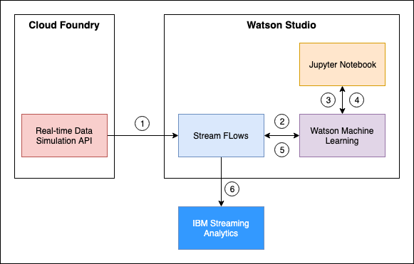
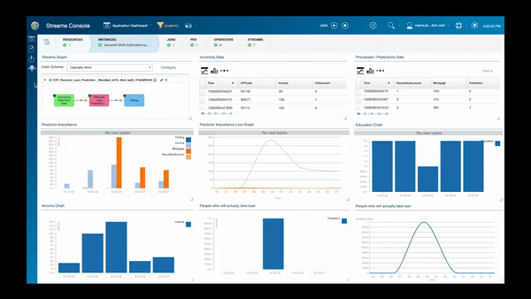

<!-- Add a new Title and fill in the blanks -->
# Live streaming and analysis of data with ML Model predictions using IBM Streaming Analytics

In this code pattern, we will create a live dashboard view of data, analyze the data and predict accordingly using IBM Streaming Analytics and Watson Studio.

Every retailer tries to sell a product to a customer but not all customers are willing to accept the product, we gather a customer-related dataset and based on that predict whether the customer will buy the product if offered. All of this will happen in real-time on a dashboard so that it helps the retailer to better understand which type of customers to target to get the maximum sales of their product.

We take the use case of a Bank selling the personal loan to its customers and predict whether the customer will accept a loan offered to them or not. We will code the Machine Learning model in a Jupyter notebook in Watson Studio and deploy the model to Watson Machine Learning. Further, we design a Streams Flow in Watson Studio that has an input node which brings in the data from various sources such as REST API calls, Stream events from a Kafka broker, IBM Event Streams, MQTT broker, Watson IoT device platform etc... which is streamed as input to the next node that is the python model invoked from Watson Machine Learning. The predictions and various features affecting the prediction are reviewed as output which is then stored in Cloud Object Storage as a CSV file. A Streaming analytics instance associated with the flow will start running as soon as the flow is deployed and live data and predictions can be monitored on the IBM Streaming Analytics dashboard in real-time.

When you have completed this code pattern, you will understand how to:

* How to deal with real-time data in IBM Streaming Analytics.
* How to design custom Stream Flows to build your own live streaming service.
* How to read any data in Streams FLow with the available nodes.
* How to create a model and deploy it to Watson Machine Learning.

<!--add an image in this path-->


<!--Optionally, add flow steps based on the architecture diagram-->
## Flow

1. Create a REST API with python and deploy it to Cloud Foundary service. Calling this API returns a json with random attribute values of the outsource dataset. Thus it simulates real-time data.
2. Create a Watson Studio instance and a Watson Machine Learning instance in IBM Cloud.
3. Create a new Jupyter notebook in Watson Studio and execute the cells to successfully train, test, get accuracy and deploy the model to Watson Machine Learning.
4. Once the Real-time data source and the machine learning model is ready the stream flow can be built. Create a new Streams Flow in Watson Studio.
5. Build a flow with input as the REST API, data processing by the deployed Watson Machine Learning model and Save the output to a csv file in Cloud Object Storage.
6. Launch the Streaming Analytics dashboard and visualize the data in real-time.

<!--Optionally, update this section when the video is created-->
## Watch the Video


## Pre-requisites
1. [IBM Cloud Account](https://cloud.ibm.com)
2. [Cloud Object Storage Service](https://cloud.ibm.com/catalog/services/cloud-object-storage)

## Steps

1. [Clone the repo](#1-clone-the-repo).
2. [Deploy the API](#2-deploy-the-api).
3. [Create Watson Services](#3-create-watson-services).
4. [Deploy the ML Model](#4-deploy-the-ml-model).
5. [Create IBM Streaming Analytics service](#5-create-ibm-streaming-analytics-service).
6. [Create the Streams Flow in Watson Studio](#6-create-the-streams-flow-in-watson-studio).
7. [Visualize the Streams Dashboard](#7-visualize-the-streams-dashboard).

### 1. Clone the repo

Clone the `live-streaming-of-IoT-data-using-streaming-analytics` repo locally. In a terminal, run:

```bash
$ git clone https://github.com/IBM/live-streaming-of-IoT-data-using-streaming-analytics
```

We’ll be using the file [`data/training-testing-data.csv`](data/training-testing-data.csv) and the folder
[`flask-API`](flask-api/).

### 2. Deploy API

In order to simulate real-time incoming data, we create an API and deploy it to Cloud Foundry.
>NOTE: IBM Streaming analytics has the following input sources: Stream events from a Kafka broker, IBM Event Streams, MQTT broker, Watson IoT device platform. If you have knowledge about any of these, then you can skip this step and create your own input block.

* Create a [Cloud Foundry](https://cloud.ibm.com/catalog/starters/cloud-foundry?runtime=python) service with python runtime and follow the steps bellow.


* Goto _`flask-api`_ directory.

```bash
$ cd flask-api/
```

* Make sure you have installed [IBM Cloud CLI](https://cloud.ibm.com/docs/cli?topic=cloud-cli-getting-started&locale=en-US) before you proceed.

* Log in to your IBM Cloud account, and select an API endpoint.
```bash
$ ibmcloud login
```

>NOTE: If you have a federated user ID, instead use the following command to log in with your single sign-on ID.
```bash
$ ibmcloud login --sso
```

* Target a Cloud Foundry org and space:
```bash
$ ibmcloud target --cf
```

* From within the _`flask-api`_ directory push your app to IBM Cloud.
```bash
$ ibmcloud cf push
```

* You will see output on your terminal as shown, verify the state is _`running`_:

```
Invoking 'cf push'...

Pushing from manifest to org manoj.jahgirdar@in.ibm.com / space dev as manoj.jahgirdar@in.ibm.com...

...

Waiting for app to start...

...

  state     since                  cpu     memory           disk           details
#0   running   2019-09-17T06:22:59Z   19.5%   103.4M of 512M   343.4M of 1G
```


### 3. Create Watson services

Create the following services:

* [**Watson Studio**](https://cloud.ibm.com/catalog/services/watson-studio)
* [**Watson Machine Learning**](https://cloud.ibm.com/catalog/services/machine-learning)

### 4. Deploy the ML Model


### 5. Create IBM Streaming Analytics service


### 6. Create the Streams Flow in Watson Studio


### 7. Visualize the Streams Dashboard

<!--Add a section that explains to the reader what typical output looks like, include screenshots -->

## Sample output



<!--Optionally, include any troubleshooting tips (driver issues, etc)-->

## Troubleshooting

* Error: Environment {GUID} is still not active, retry once status is active

  > This is common during the first run. The app tries to start before the Watson Discovery
environment is fully created. Allow a minute or two to pass. The environment should
be usable on restart. If you used **Deploy to IBM Cloud** the restart should be automatic.

* Error: Only one free environment is allowed per organization

  > To work with a free trial, a small free Watson Discovery environment is created. If you already have
a Watson Discovery environment, this will fail. If you are not using Watson Discovery, check for an old
service thay you might want to delete. Otherwise, use the `.env DISCOVERY_ENVIRONMENT_ID` to tell
the app which environment you want it to use. A collection will be created in this environment
using the default configuration.

<!-- keep this -->
## License

This code pattern is licensed under the Apache License, Version 2. Separate third-party code objects invoked within this code pattern are licensed by their respective providers pursuant to their own separate licenses. Contributions are subject to the [Developer Certificate of Origin, Version 1.1](https://developercertificate.org/) and the [Apache License, Version 2](https://www.apache.org/licenses/LICENSE-2.0.txt).

[Apache License FAQ](https://www.apache.org/foundation/license-faq.html#WhatDoesItMEAN)
